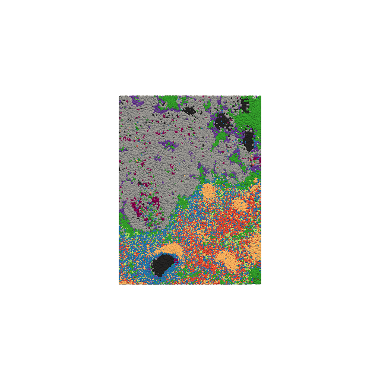

Welcome to UniST documentation!
===================================

**UniST** is a Python library for a unified computational framework for reconstructing dense and continuous 3D spatial transcriptomics from sparse serial sections.

Get start
--------

.. toctree::
   :maxdepth: 2

   overview

   installation

   quick_start

   tutorial

   GitHub <https://github.com/lanshui98/UniST>
